# Actividad3-Criptografia
PSP- AE-3. Criptografía

Realizada por:
Alberto Arroyo Santofimia

https://github.com/AlbertoArroyoS/Actividad3-Criptografia

# Objetivos
Aprender a manejar la criptografía simétrica y asimétrica, así como los algoritmos hash.

# Pautas de elaboración

## Requerimiento 1

Se pide hacer una aplicación que encripte frases introducidas por el usuario de manera simétrica.

La aplicación mostrará el siguiente menú

Salir del programa

Encriptar frase

Desencriptar frase

Con la opción 1 el programa le pedirá al usuario una frase, la encriptará y la guardará en memoria.

Con la opción 2 el programa mostrará la frase desencriptándola.

Solo se guardará una frase al mismo tiempo. Se utilizará un método de encriptación simétrico.

## Requerimiento 2

Se pide agregar seguridad a la aplicación para poder entrar. El programa arrancará con 3 objetos usuario que tendrá su nombre de usuario y su contraseña “hasheada”. Los objetos permanecerán en memoria durante todo el programa.

Antes de mostrar el menú, el programa pedirá que se introduzca el nombre del usuario y su contraseña (sin “hashear”), en caso de que sea correcto, se mostrará el menú y un mensaje de bienvenida al usuario con su nombre, en caso contrario se le volverá a pedir hasta un máximo de tres veces. Si en tres intentos no se ha conseguido introducir bien los datos de ningún usuario registrado, la aplicación se detendrá.

Requerimiento 1

método de encriptación simétrico

La aplicación mostrará el siguiente menú

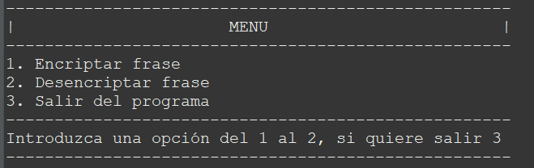

**Control de errores para controlar la entrada incorrecta**

Caracter no numérico

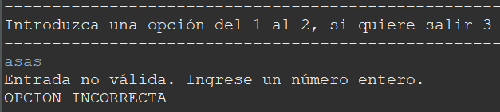

Numero fuera de rango

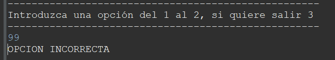

Opción 1: Encriptar frase

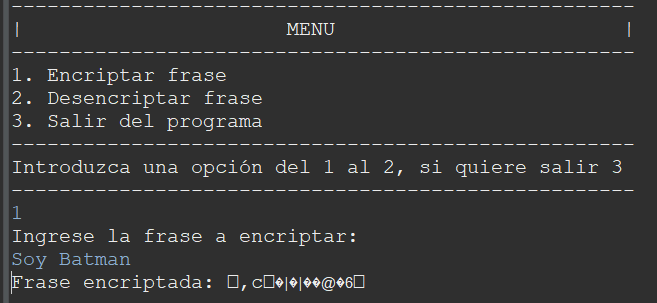

Opción 2: Desencriptar

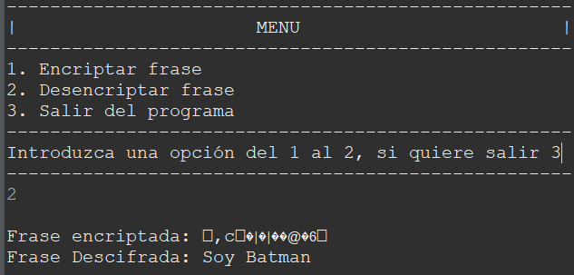

Opción 3: Salir

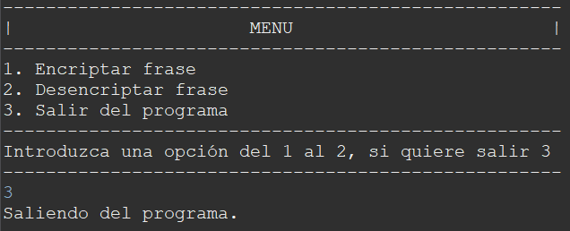

Requerimiento 2

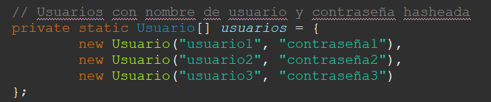

Al crear un nuevo objeto usuario, la contraseña se hasheará en el
constructor automáticamente SHA-512 y Base64

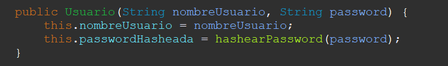

Si se introduce el usuario correcto

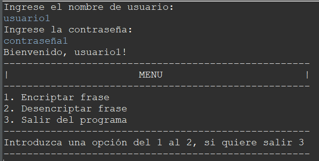

La contraseña introducida por teclado se comparará en el método
verificarPassword de la clase Usuario, en la que entrará por parámetro
la contraseña introducida, la pasará a hash y la compara con la que
tienen los objetos

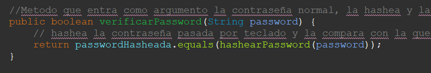

Si se introducen 3 usuarios incorrectos

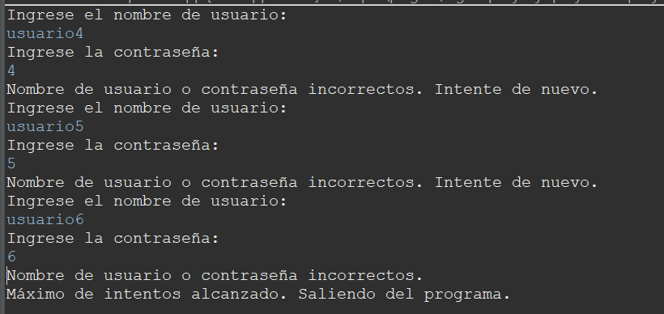

